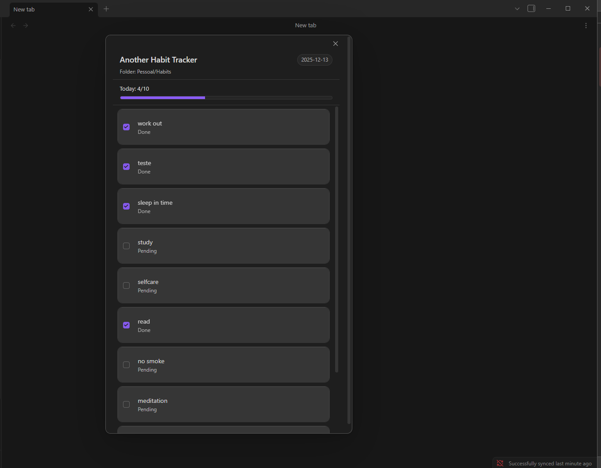
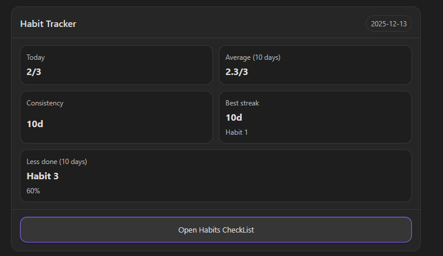
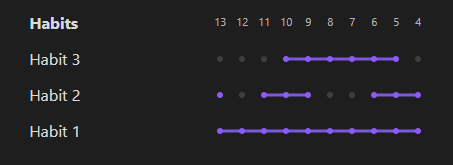

# Another Habit Tracker (Obsidian Plugin)

A lightweight habit tracker for Obsidian that uses **frontmatter** to store daily check-ins and provides:

* A **modal** to quickly mark today’s habits (desktop + mobile friendly)
* **Codeblocks** to render stats and visual views inside notes
* A **settings** page to choose which folder contains your habit notes
* A **ribbon icon** + command to open the modal quickly

## Screenshots

### Modal 


### Card Codeblock


### Timeline Codeblock


## How it works

Each habit is represented by a markdown file inside a configured folder (example: `Pessoal/Habits/`).

Each file stores completion dates in its frontmatter:

```yaml
---
entries:
  - 2025-12-11
  - 2025-12-12
---
```

Dates are stored in `YYYY-MM-DD` format.

## Features

### 1) Modal (mark habits for today)

Open a modal listing all habit files in your configured folder.
Toggling a checkbox adds/removes today’s date in that habit file frontmatter.

You can open the modal via:

* Ribbon icon (left sidebar)
* Command Palette: **Another Habit Tracker: Open habit modal**

### 2) Codeblocks

#### Stats card

Renders a small summary card (example: today count, averages, streaks).

````md
```another-habit-tracker
{}
```
````

#### Grid timeline view

Renders a grid-like habit timeline for the last N days (configured via the codeblock).

````md
```another-habit-tracker-grid
{ "days": 10 }
```
````

> Notes:
>
> * The plugin uses your local system date.
> * Data is computed from your habit files inside the configured folder.
>

## Settings

Go to:
**Settings → Community plugins → Another Habit Tracker**

* **Habits folder**: path inside your vault (e.g. `Habits`)

## Development

Install deps and run in watch mode:

```bash
npm install
npm run dev
```

This runs:

* esbuild in watch mode
* vitest in watch mode

## License

MIT
